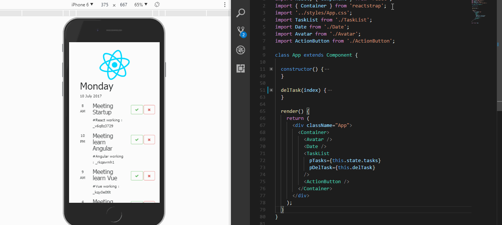

<p align="center">
</a>
</p>

# TodoList
> ตัวอย่างการทำ การใช้ reactstrap (https://reactstrap.github.io) ร่วมกับ ReactJS <br />
> จุดประสงค์เพื่อศึกษา React และลองประยุกต์ใช้

### การติดตั้ง
#### 1. ติดตั้งผ่าน npm โดยพิม npm install
```
  npm install
```
#### 2. สั่ง start โดยพิม npm start

```
  npm start
```

